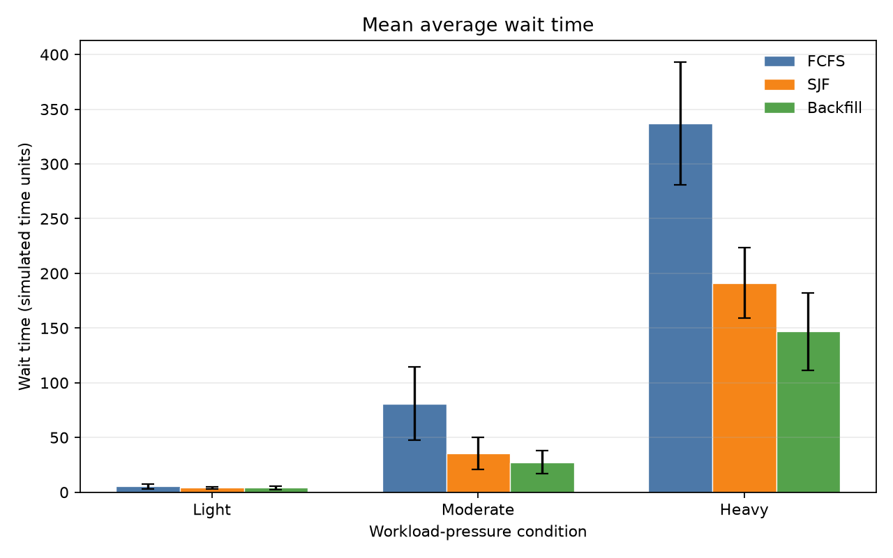
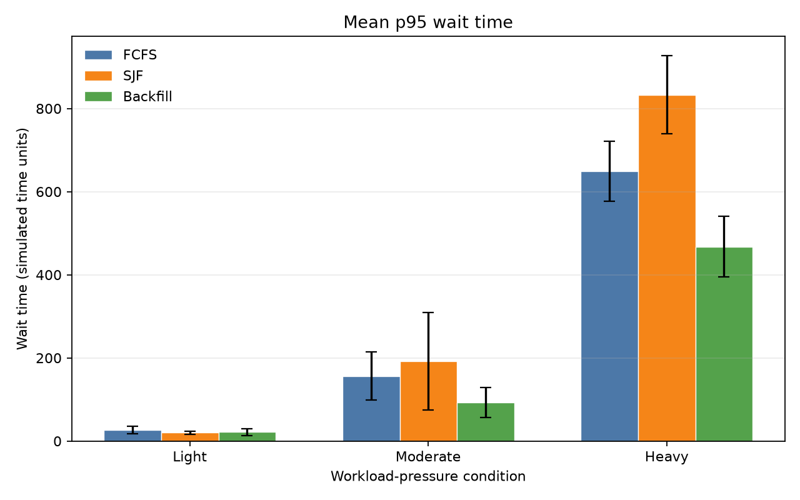

# cluster-scheduler-sim

A discrete-event batch scheduling simulator written in C++. It models homogeneous CPU nodes and compares strict first-come, first-served (FCFS), non-preemptive shortest job first (SJF), and simple greedy backfilling. Python scripts generate synthetic workloads, analyze result CSVs, and reproduce a controlled single-node experiment.

## How it works

Each job has a submission time, requested runtime, and CPU request. The simulator processes arrivals and completions in simulated-time order. A scheduling policy selects jobs from the waiting queue when CPUs are available; running jobs are non-preemptive, and their CPUs return to the assigned node when they complete.

The default configuration is one 8-CPU node. A job must fit entirely on one node, and placement uses deterministic first-fit order by node ID.

## Build and use

```sh
cmake -S . -B build
cmake --build build
```

Run the provided workload with any policy:

```sh
./build/cluster-scheduler-sim workloads/example.csv /tmp/fcfs-results.csv fcfs
./build/cluster-scheduler-sim workloads/example.csv /tmp/sjf-results.csv sjf
./build/cluster-scheduler-sim workloads/example.csv /tmp/backfill-results.csv backfill
```

The policy argument is optional and defaults to `fcfs`.

Configure a homogeneous multi-node cluster with two optional flags:

```sh
./build/cluster-scheduler-sim workloads/multinode.csv /tmp/multinode-results.csv \
    backfill --nodes 2 --cpus-per-node 4
```

The workload schema is:

```text
job_id,submission_time,requested_runtime,requested_cpus
```

Generate a reproducible synthetic workload:

```sh
python3 scripts/generate_workload.py \
    --jobs 100 \
    --seed 42 \
    --output /tmp/generated-workload.csv
```

Analyze one or more result files:

```sh
python3 scripts/analyze_results.py \
    --total-cpus 8 \
    --result fcfs=/tmp/fcfs-results.csv \
    --result sjf=/tmp/sjf-results.csv \
    --result backfill=/tmp/backfill-results.csv \
    --output /tmp/summary.csv
```

The analyzer verifies that compared files contain the same submitted workload. It reports completed jobs, average/median/nearest-rank p95 wait, average turnaround, throughput in jobs per simulated time unit, and CPU utilization.

## Scheduling policies

| Policy | Selection rule |
|---|---|
| FCFS | Selects the earliest submitted waiting job. If that job cannot fit, later jobs do not run. |
| SJF | Selects the waiting job with the shortest requested runtime. It is non-preemptive, and a blocked highest-priority job is not bypassed. |
| Backfill | Keeps FCFS priority but may run later jobs when the front job is blocked and they fit on a currently available node. |

Backfill is a greedy current-capacity scan with no future reservation. It is not SLURM or EASY backfill.

## Experiment

The original controlled experiment uses 200 jobs, seeds 1–10, three submission-pressure conditions, and all three policies: 90 simulations with a configuration of 1 node × 8 CPUs. For each seed, the conditions preserve job IDs, runtimes, and CPU requests and change only submission-time spacing. These results do not measure multi-node behavior.

Heavy-pressure aggregate means across the ten seeds:

| Policy | Average wait | Median wait | P95 wait | CPU utilization |
|---|---:|---:|---:|---:|
| FCFS | 337.02 | 333.05 | 649.20 | 77.12% |
| SJF | 191.34 | 13.20 | 833.00 | 80.91% |
| Backfill | 147.02 | 92.75 | 467.50 | 93.96% |

- Under light pressure, all policies had zero median wait and nearly identical throughput and utilization.
- Under moderate and heavy pressure, FCFS accumulated larger waits and lower utilization. SJF kept median wait low but had the highest heavy-pressure p95 in every seed.
- Backfill had the lowest aggregate mean and p95 waits under moderate and heavy pressure and the highest utilization, while SJF retained the lower median. The experiment did not show a systematic backfill p95 penalty from the lack of reservations.





The figures show means with sample standard deviation error bars. The [experiment note](experiments/README.md) contains the full results, run-level data, methodology, and limitations.

## Reproduce the experiment

After building the simulator:

```sh
python3 scripts/run_experiments.py \
    --simulator ./build/cluster-scheduler-sim \
    --output-dir experiments
```

Experiment execution uses the Python standard library. Matplotlib is needed only to regenerate the figures:

```sh
python3 -m pip install -r requirements.txt
python3 scripts/plot_experiments.py \
    --summary experiments/summary.csv \
    --output-dir experiments/figures
```

Raw workloads and per-job results are written under the ignored `experiments/raw/` directory. The run-level metrics, aggregate summary, and final figures remain source-controlled.

## Limitations

- Homogeneous CPU-only nodes; no memory, GPU, network, or heterogeneous capacities
- Jobs cannot span nodes, and first-fit is the only placement rule
- Synthetic workloads with known fixed runtimes rather than production traces
- Non-preemptive execution and sequential processing of same-time arrivals
- Vector-based waiting queues with linear policy scans
- Simple greedy backfill without reservations or production SLURM fidelity
- The source-controlled experiment covers only the original one-node, 8-CPU configuration
- Descriptive results for ten seeds, without statistical-significance claims
