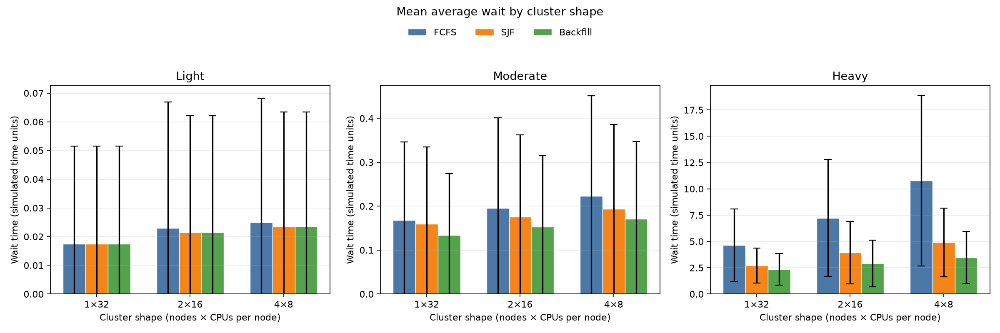
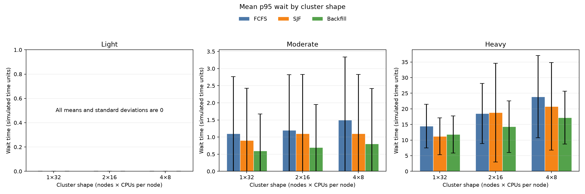
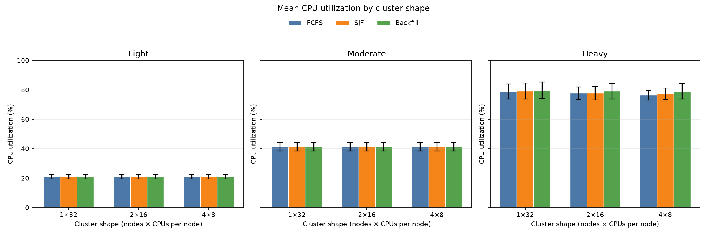

# Controlled multi-node experiment

## Question

How does partitioning the same 32-CPU capacity across homogeneous nodes affect FCFS, non-preemptive SJF, and greedy backfill under deterministic first-fit placement?

## Design

The experiment compares three cluster shapes with identical aggregate capacity:

| Cluster shape | Nodes | CPUs per node | Total CPUs |
|---|---:|---:|---:|
| `1x32` | 1 | 32 | 32 |
| `2x16` | 2 | 16 | 32 |
| `4x8` | 4 | 8 | 32 |

Every generated CPU request is one of `1`, `2`, `4`, or `8`, so every job fits an empty node in every shape. Differences therefore arise while jobs contend for node-local capacity, not because splitting the cluster makes some jobs invalid.

For each seed from 1 through 10, the generator creates one 200-job base composition. Job IDs, runtimes, and CPU requests remain fixed across all conditions, shapes, and policies. Submission times are scaled directly from that base:

| Condition | Submission-time scale |
|---|---:|
| Light | 4 |
| Moderate | 2 |
| Heavy | 1 |

These names describe relative arrival pressure, not target utilization percentages. The fixed matrix is 10 seeds × 3 conditions × 3 shapes × 3 policies, producing 270 simulations.

One workload file is shared by all nine shape/policy runs for a given seed and condition. The runner also compares the complete job signature—ID, submission time, runtime, and CPU request—across all nine result files. Across load conditions, it separately verifies that job composition is unchanged and that submission times equal the declared scale applied to the base workload.

[`run_metrics.csv`](run_metrics.csv) contains one row per simulation. [`summary.csv`](summary.csv) contains 27 condition/shape/policy groups and reports arithmetic means and sample standard deviations across all ten seeds. As in the original experiment, noninteger run-level metrics are published to six decimal places and those published values are the aggregation source. Metric definitions are unchanged from [`analyze_results.py`](../../scripts/analyze_results.py): average wait, median wait, nearest-rank p95 wait, average turnaround, throughput, and CPU utilization.

## Results

The table shows mean ± sample standard deviation. The complete aggregate file also contains completed-job, average-turnaround, and throughput statistics.

| Load | Shape | Policy | Average wait | Median wait | P95 wait | CPU utilization (%) |
|---|---|---|---:|---:|---:|---:|
| Light | 1x32 | FCFS | 0.018 ± 0.034 | 0.000 ± 0.000 | 0.00 ± 0.00 | 20.85 ± 1.46 |
| Light | 1x32 | SJF | 0.018 ± 0.034 | 0.000 ± 0.000 | 0.00 ± 0.00 | 20.85 ± 1.46 |
| Light | 1x32 | Backfill | 0.018 ± 0.034 | 0.000 ± 0.000 | 0.00 ± 0.00 | 20.85 ± 1.46 |
| Light | 2x16 | FCFS | 0.023 ± 0.044 | 0.000 ± 0.000 | 0.00 ± 0.00 | 20.85 ± 1.46 |
| Light | 2x16 | SJF | 0.021 ± 0.041 | 0.000 ± 0.000 | 0.00 ± 0.00 | 20.85 ± 1.46 |
| Light | 2x16 | Backfill | 0.021 ± 0.041 | 0.000 ± 0.000 | 0.00 ± 0.00 | 20.85 ± 1.46 |
| Light | 4x8 | FCFS | 0.025 ± 0.043 | 0.000 ± 0.000 | 0.00 ± 0.00 | 20.85 ± 1.46 |
| Light | 4x8 | SJF | 0.024 ± 0.040 | 0.000 ± 0.000 | 0.00 ± 0.00 | 20.85 ± 1.46 |
| Light | 4x8 | Backfill | 0.024 ± 0.040 | 0.000 ± 0.000 | 0.00 ± 0.00 | 20.85 ± 1.46 |
| Moderate | 1x32 | FCFS | 0.168 ± 0.179 | 0.000 ± 0.000 | 1.10 ± 1.66 | 41.22 ± 2.85 |
| Moderate | 1x32 | SJF | 0.160 ± 0.175 | 0.000 ± 0.000 | 0.90 ± 1.52 | 41.22 ± 2.85 |
| Moderate | 1x32 | Backfill | 0.134 ± 0.140 | 0.000 ± 0.000 | 0.60 ± 1.07 | 41.22 ± 2.85 |
| Moderate | 2x16 | FCFS | 0.196 ± 0.206 | 0.000 ± 0.000 | 1.20 ± 1.62 | 41.22 ± 2.85 |
| Moderate | 2x16 | SJF | 0.176 ± 0.186 | 0.000 ± 0.000 | 1.10 ± 1.73 | 41.22 ± 2.85 |
| Moderate | 2x16 | Backfill | 0.152 ± 0.162 | 0.000 ± 0.000 | 0.70 ± 1.25 | 41.22 ± 2.85 |
| Moderate | 4x8 | FCFS | 0.224 ± 0.228 | 0.000 ± 0.000 | 1.50 ± 1.84 | 41.21 ± 2.86 |
| Moderate | 4x8 | SJF | 0.194 ± 0.193 | 0.000 ± 0.000 | 1.10 ± 1.73 | 41.21 ± 2.86 |
| Moderate | 4x8 | Backfill | 0.171 ± 0.177 | 0.000 ± 0.000 | 0.80 ± 1.62 | 41.21 ± 2.86 |
| Heavy | 1x32 | FCFS | 4.652 ± 3.452 | 2.700 ± 3.561 | 14.50 ± 6.98 | 78.85 ± 5.03 |
| Heavy | 1x32 | SJF | 2.708 ± 1.646 | 0.600 ± 0.843 | 11.20 ± 5.90 | 79.09 ± 5.43 |
| Heavy | 1x32 | Backfill | 2.361 ± 1.500 | 0.200 ± 0.632 | 11.80 ± 5.96 | 79.58 ± 5.63 |
| Heavy | 2x16 | FCFS | 7.237 ± 5.559 | 5.650 ± 5.972 | 18.50 ± 9.64 | 77.78 ± 4.15 |
| Heavy | 2x16 | SJF | 3.941 ± 2.964 | 0.700 ± 0.823 | 18.80 ± 15.82 | 77.67 ± 4.55 |
| Heavy | 2x16 | Backfill | 2.902 ± 2.232 | 0.400 ± 0.966 | 14.30 ± 8.29 | 79.07 ± 5.27 |
| Heavy | 4x8 | FCFS | 10.773 ± 8.112 | 9.600 ± 8.909 | 23.90 ± 13.16 | 76.23 ± 3.28 |
| Heavy | 4x8 | SJF | 4.918 ± 3.263 | 1.200 ± 1.229 | 20.80 ± 14.01 | 77.31 ± 3.86 |
| Heavy | 4x8 | Backfill | 3.474 ± 2.488 | 0.600 ± 1.265 | 17.20 ± 8.47 | 78.99 ± 5.18 |

### Light pressure

Cluster shape had little practical effect. Mean waits stayed at or below 0.025 time units, and both median and p95 wait were zero for every shape and policy. Throughput and utilization were identical across shapes. Only three of ten seeds showed any increase in mean wait from `1x32` to `4x8`; the largest FCFS increase within a seed was 0.05 time units.

### Moderate pressure

Partitioning raised mean wait slightly, but the absolute changes remained small relative to the between-seed variation. From `1x32` to `4x8`, mean wait rose from 0.168 to 0.224 for FCFS, 0.160 to 0.194 for SJF, and 0.134 to 0.171 for backfill. Median wait remained zero throughout. P95 increased in only three FCFS seeds, two SJF seeds, and one backfill seed; one backfill seed improved. Mean utilization changed by only 0.006 percentage points, reflecting one seed with a slightly longer makespan in `4x8`.

### Heavy pressure

Shape effects became clear. Moving from `1x32` to `4x8` increased mean wait in all ten seeds under every policy. FCFS rose by 6.121 time units, or 131.6%; SJF rose by 2.210, or 81.6%; and backfill rose by 1.114, or 47.2%. P95 wait also increased in all ten seeds: by 9.4 for FCFS, 9.6 for SJF, and 5.4 for backfill.

FCFS was most sensitive to node-local blocking. Its mean wait reached 10.773 on `4x8`, compared with 4.918 for SJF and 3.474 for backfill. Backfill therefore mitigated, but did not eliminate, the effect of splitting capacity: on `4x8` its mean wait was 67.8% below FCFS, its p95 was 28.0% lower, and its utilization was 2.76 percentage points higher.

SJF continued to favor the center of the distribution more than the tail. Its heavy median stayed far below FCFS—1.2 versus 9.6 on `4x8`—while its p95 increased from 11.2 on `1x32` to 20.8 on `4x8`. Its `2x16` p95 mean was 18.8, slightly above FCFS's 18.5, with a much larger 15.82 sample standard deviation. Unlike the original `1x8` experiment, backfill—not SJF—had the lowest aggregate heavy median at every shape in this experiment. SJF favors short runtimes rather than small CPU requests, so it does not directly target node-local gaps.

Heavy-run variability was substantial. On `4x8`, mean-wait sample standard deviations were 8.11 for FCFS, 3.26 for SJF, and 2.49 for backfill; p95 standard deviations were 13.16, 14.01, and 8.47. The direction of the `1x32`-to-`4x8` mean and p95 increases was nevertheless consistent across all ten seeds for all three policies.

## Interpretation

With identical workloads and aggregate capacity, splitting CPUs across nodes introduces per-node fit constraints that can leave free capacity unusable by the highest-priority job. The observed effects grew with arrival pressure and with finer partitioning under first-fit placement. The outcome metrics are sufficient for this comparison, so no direct fragmentation instrumentation was added; they do not measure the amount or duration of fragmented free capacity itself.

Backfill recovered some opportunities that strict FCFS left unused, especially under heavy contention. The benefit was visible more strongly in wait time than in aggregate utilization: from `1x32` to `4x8`, FCFS utilization fell 2.62 percentage points, SJF fell 1.78 points, and backfill fell 0.59 points. Because every run for a fixed seed and condition performs the same CPU-time work, throughput and utilization both primarily reflect makespan and should not be treated as independent evidence.

One result that tempers a simple fragmentation story is how little changed under moderate pressure. Despite small increases in wait, makespan—and therefore utilization and throughput—was almost always identical across shapes and policies. Node partitioning under first-fit became materially important only when the declared workload created sustained contention. Even under heavy pressure, backfill's `4x8` utilization improved over its pooled value in one seed, tied in four, and fell in five; partitioning can change greedy execution order rather than imposing a pointwise penalty on every run.

## Figures

Each figure contains separate light, moderate, and heavy panels. Wait-time panels use independent vertical scales so the low-pressure results remain visible. Error bars show one sample standard deviation across seeds.







## Reproduce

After building the simulator:

```sh
python3 scripts/run_multinode_experiments.py \
    --simulator ./build/cluster-scheduler-sim \
    --output-dir experiments/multinode

python3 -m pip install -r requirements.txt
python3 scripts/plot_multinode_experiments.py \
    --summary experiments/multinode/summary.csv \
    --output-dir experiments/multinode/figures
```

Raw workloads and per-job result files are regenerated under the ignored `experiments/multinode/raw/` directory.

## Limitations

This is a descriptive experiment over ten seeds from one synthetic generator. It covers only homogeneous CPU nodes, fixed known runtimes, non-preemptive jobs, deterministic first-fit placement, and the declared `1x32`, `2x16`, and `4x8` shapes. It does not isolate first-fit from node partitioning, measure fragmentation directly, establish statistical significance, or generalize to production clusters. Greedy backfill still has no reservations, and SJF assumes accurate requested runtimes.
